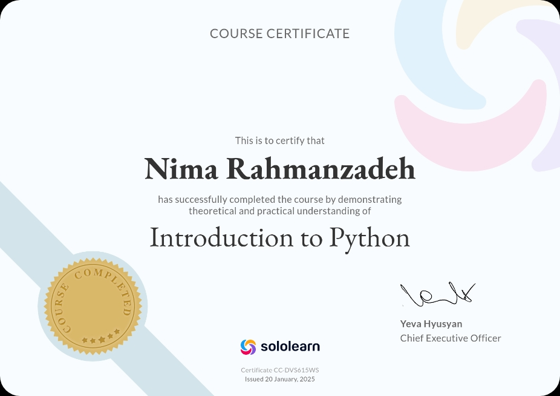

# Week 2 Practices

## delete_duplicate.py

This program gets a list from the user and deletes the duplicate values.

## even_filter.py

This program gets a list from the user and adds the even values to another list and shows it in the output.

## list_rotate.py

This program gets a list and the number of rotations from the user and rotates the elements inside the list by the specified number of rotations.

## score_calculator.py

This program gets a list of scores from the user and calculates the average of the scores.

## My Certificate

